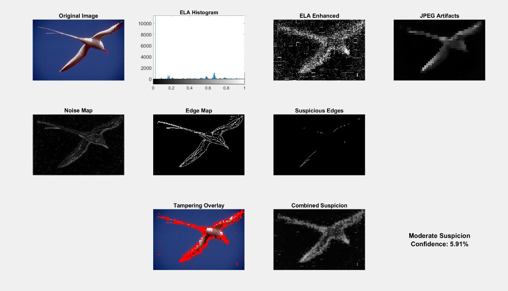

# Digital Image Forensics Dashboard: A MATLAB-Based Forgery Detection System

## 📌 Overview
The **Digital Image Forensics Dashboard** is an advanced MATLAB-based system designed to authenticate digital images and detect malicious tampering. In an era of Deepfakes and AI-generated content, the ability to blindly detect image manipulations—such as splicing, copy-move forgery, and retouching—is critical for digital security, journalism, and legal forensics.

This project implements a **"Defense-in-Depth"** strategy, moving beyond single-algorithm detection to a robust **Evidence Fusion Framework**. By running five distinct passive forensic algorithms in parallel and synthesizing their results, this tool minimizes false positives and provides a high-confidence verdict on image integrity.

---

## 🚀 Key Features

* **Multi-Modal Analysis:** Simultaneously analyzes compression artifacts, sensor noise fingerprints, edge gradients, and pixel block correlations.
* **Evidence Fusion Engine:** A novel weighted voting algorithm combines normalized outputs from all five detectors to generate a single **"Combined Suspicion Map"**.
* **Automated Reporting:** Generates a unified $3 \times 4$ forensic dashboard visualizing every stage of analysis.
* **Object-Oriented Architecture:** Built on a modular `ImageTamperingDetector` class, ensuring scalability and ease of integration.
* **Blind Detection:** Requires **no prior knowledge** of the source camera or the original image to function effectively.

---

## 🔬 Technical Methodology & Algorithms

The core of the system lies in its ability to detect the "invisible scars" left by image manipulation. The following five forensic techniques are implemented:

### 1. Error Level Analysis (ELA)
* **Forensic Principle:** JPEG compression is lossy. When an image is resaved, valid pixels degrade at a known rate. Spliced regions, originating from a different source with a unique compression history, will degrade at a different rate (or "glow") when subjected to recompression.
* **Implementation Details:**
    1.  The image is resaved at 95% quality.
    2.  The absolute pixel difference is computed: $ELA = |Original - Resaved|$.
    3.  **Gamma Correction** and **Adaptive Histogram Equalization (CLAHE)** are applied to the difference map to visualize subtle error residuals invisible to the naked eye.

### 2. Noise Inconsistency Detection (PRNU Analysis)
* **Forensic Principle:** Every camera sensor imparts a unique, high-frequency noise pattern known as Photo-Response Non-Uniformity (PRNU). When an object is pasted from a different image, it carries a foreign noise fingerprint.
* **Implementation Details:**
    1.  A **Wiener Filter** is applied to estimate the "true" underlying image signal.
    2.  The "Noise Residual" is extracted by subtracting the filtered image from the original.
    3.  **K-Means Clustering ($k=2$ or $k=3$)** is deployed to segment the noise map, automatically isolating regions with statistically anomalous noise variance.

### 3. JPEG Block Artifact Analysis
* **Forensic Principle:** The JPEG standard processes images in non-overlapping $8 \times 8$ pixel blocks. Manipulation operations like resizing, rotation, or splicing disrupt this rigid grid alignment.
* **Implementation Details:**
    1.  The image is converted to the YCbCr color space to isolate the Luminance (Y) channel.
    2.  **Block Processing (`blockproc`)** is used to compute the local Standard Deviation (`std2`) for every $8 \times 8$ block.
    3.  Discontinuities in block statistics reveal "ghost grids" or disjointed regions indicative of tampering.

### 4. Edge Inconsistency Analysis
* **Forensic Principle:** Artificial composites often exhibit edges that are unnatural compared to the global scene—either too sharp (due to hard cropping) or too blurry (due to feathering/smoothing).
* **Implementation Details:**
    1.  Edges are detected using a robust combination of **Canny**, **Sobel**, and **Prewitt** operators.
    2.  The gradient magnitude is computed for every edge pixel using `imgradientxy`.
    3.  Edges with magnitudes deviating more than **$2\sigma$** (standard deviations) from the median edge strength are flagged as suspicious outliers.

### 5. Copy-Move Forgery Detection
* **Forensic Principle:** A common forgery technique involves "cloning" a region of an image to hide an object or duplicate a crowd. This results in two identical regions within the same image.
* **Implementation Details:**
    1.  The image is divided into overlapping $16 \times 16$ blocks.
    2.  **Discrete Cosine Transform (DCT)** coefficients are extracted for each block to create robust feature vectors.
    3.  A **Correlation Matrix** is computed to find pairs of blocks with a correlation coefficient $>0.95$.
    4.  To filter out false positives (like flat sky areas), only pairs separated by a minimum Euclidean distance are flagged.

---

## 🛠️ Installation & Setup

### Prerequisites
Ensure you have **MATLAB** (R2021a or newer) installed with the following toolboxes:
* **Image Processing Toolbox™** (Required for `edge`, `blockproc`, `wiener2`)
* **Statistics and Machine Learning Toolbox™** (Required for `kmeans`)

### Installation Steps
1.  **Clone the Repository:**
    ```bash
    git clone [https://github.com/moonsandsk/Image-Forensics.git](https://github.com/moonsandsk/Image-Forensics.git)
    cd Image-Forensics
    ```

2.  **Prepare Your Data:**
    * Place your suspect images (JPG, PNG, TIFF) into the `Data/` folder.
    * *(Optional)*: Use the provided sample images like `lion[1].jpg` or `bird_output.jpg`.

3.  **Run the Analysis:**
    * Open `run.m` in MATLAB.
    * Edit the `imageName` variable to match your target image:
        ```matlab
        imageName = 'my_suspect_image.jpg'; 
        ```
    * Click **Run** or press **F5**.

---

## 📊 Interpreting the Results

The tool generates a comprehensive report saved automatically to the `Outputs/` folder. Below is an example of the generated dashboard:



| Forensic Map | Interpretation Guide |
| :--- | :--- |
| **ELA Enhanced** | **Bright, glowing regions** indicate a compression anomaly. A genuine image should appear uniformly dark. |
| **Noise Map** | **Solid, coherent shapes** in the noise field are suspicious. Genuine sensor noise should look like random "salt-and-pepper" static. |
| **JPEG Artifacts** | **Blocky islands** that do not match the texture of the rest of the image suggest a grid misalignment caused by splicing. |
| **Suspicious Edges** | This map *only* displays edges that are statistically abnormal. If it clearly **outlines an object**, that object was likely pasted. |
| **Copy-Move Map** | **White patches** indicate confirmed cloned regions. This is a definitive sign of tampering. |
| **Tampering Overlay** | **The Final Verdict.** A red semi-transparent mask overlays the high-confidence tampered regions, synthesized from all 5 tests. |

---

## 🧪 Validation & Datasets

This tool has been rigorously tested and validated on:
1.  **[CASIA 2.0 Image Tampering Detection Dataset](https://www.kaggle.com/datasets/divg07/casia-20-image-tampering-detection-dataset):** A benchmark dataset containing thousands of realistic spliced and copy-moved images.
2.  **Custom Synthetic Dataset:** Created manually using Adobe Photoshop and GIMP to simulate challenging scenarios, such as:
    * Inserting objects into complex textured backgrounds.
    * Cloning elements to hide distinct features.

---

## ⚠️ Limitations & Future Roadmap

While highly effective, the current implementation has specific constraints:
* **Computational Cost:** The block-based Copy-Move algorithm has a time complexity of $O(n^2)$, making it slower for 4K+ resolution images.
    * *Future Work:* Implement **SIFT/SURF keypoint matching** to reduce complexity to $O(n \log n)$.
* **Uncompressed Sources:** ELA and Artifact detection rely heavily on JPEG compression traces. Their efficacy is reduced on pristine RAW or TIFF images.
    * *Future Work:* Integration of a **Convolutional Neural Network (CNN)** trained on noise residuals to detect manipulation in uncompressed media.

---

## 📜 Acknowledgments

Developed by: [Aditi Chandra](https://github.com/aditi-moonsandsk) & [Abheeshta V Aradhya](https://github.com/abheeshta-username)
